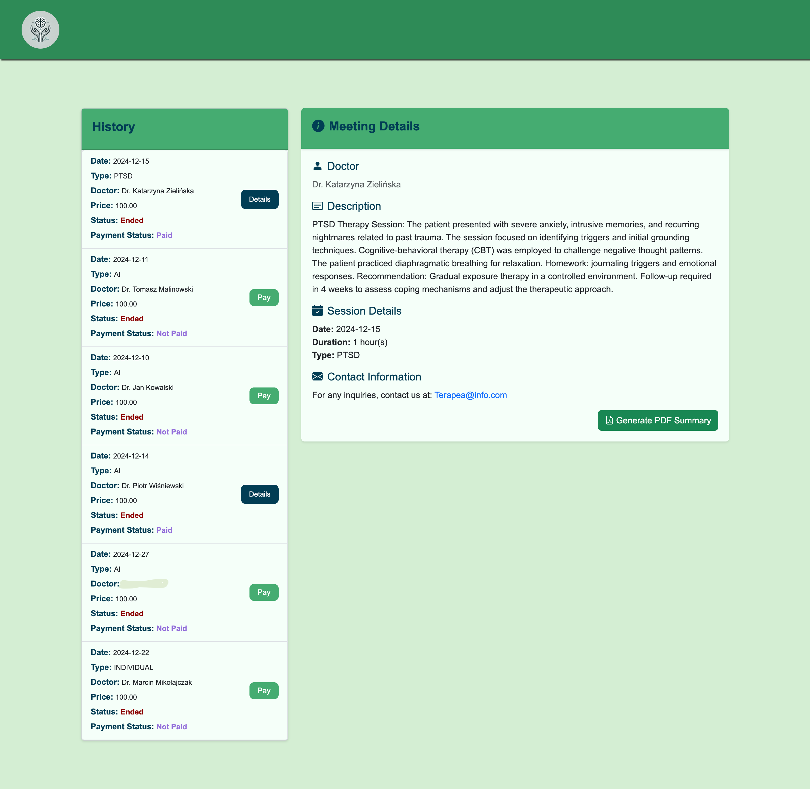

# WWW_project

https://adamzulu123.github.io/WWW_project/

## Therapea  

Therapea is a modern, user-friendly web application designed to make online therapy services more accessible. It provides a range of services, including AI-assisted therapy, PTSD treatment, and couples' counseling sessions.  

This project features both a patient and doctor panel, offering:  
- Multiple payment options.  
- Meeting booking and scheduling functionalities.  
- A detailed therapy history with the ability to download session summaries in PDF format.  

## Technologies 
The project was developed using the following technologies:  
- **HTML5, CSS3, JavaScript**: Core technologies for building a responsive and interactive user interface.  
- **Bootstrap**: Framework for a clean and mobile-first design.  
- **Node.js (Express.js)**: Backend for server-side functionality.  
- **MySQL**: A robust relational database for securely storing user data, therapy session details, and payment information.  
- **Sequelize**: An ORM (Object-Relational Mapping) library for Node.js, used to manage database models and simplify interactions with MySQL.  
- **EJS (Embedded JavaScript)**: A templating engine that dynamically generates HTML pages on the server, ensuring smooth and interactive user experiences.  
- **PDFKit**: A library used for creating and exporting therapy session summaries as downloadable PDF files.  
- **FullCalendar**: Calendar library used for displaying avaiable meetings on the calendar. 
- **bcrypt**

## Project structure 
This project combines both RESTful API endpoints and server-side rendered (SSR) views to deliver a seamless user experience:

RESTful API Endpoints:
- RESTful endpoints are used to dynamically return data in JSON format, enabling features like the interactive calendar in the "Services" section. For instance, endpoints like /services/:category fetch available appointments for a specific therapy category.

Server-Side Rendering (SSR) with EJS:
- EJS templates are utilized to generate dynamic, personalized HTML pages for users. This approach ensures secure and efficient rendering of user-specific data, such as in the "User account" section, where users can view their personal data. 

## Folders structure
1. **/css** 
2. **/html**: not used
3. **/views**: EJS files. 
4. **/images**: logo, photos for main page generated with chatGBT. 
5. **/js**: Contains JavaScript files for animations and dynamic functionalities. These scripts handle tasks such as fetching JSON data from endpoints, dynamically updating HTML, and verifying user login status. 
6. **/src**:  Backend structure components

    a. **controllers**: Application logic for handling requests and responses.

    b. **middleware**: Loading payment methods on every which needs it, before loading this page. 

    c. **models**: Database models for defining data structures - SEQUELIZE.

    d. **routers**: used to define application routes, handle HTTP requests, and link them to corresponding controller functions for modular and organized code structure.

    e. **database.js**: Configuration for database connection.

7. **server.js**: The entry point of the application, initializing the server and connecting the backend components.

## WebApp view 

